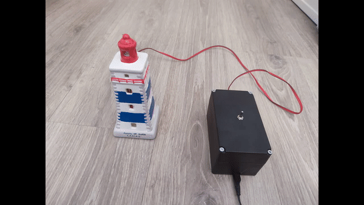
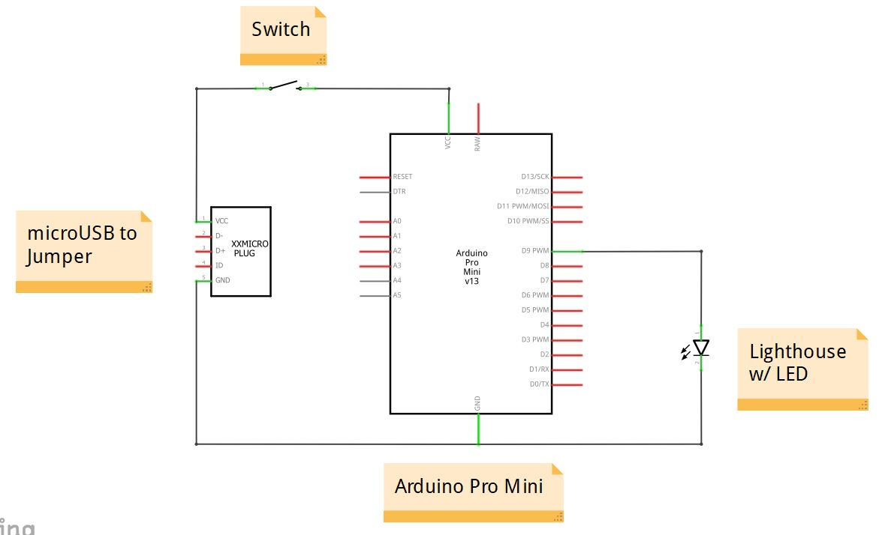

# Lighthouse
An Arduino Pro Mini-based device that mimics a lighthouse by fading an LED using PWM.

## Circuit
### Components
* Arduino Pro Mini
* microUSB to Jumper (Male)
* LED
* Switch
* Lighthouse

### Connection

### Description
* An LED is mounted inside a lighthouse; 
* The LED is connected to an Arduino Pro Mini;
* The Arduino board fades the LED using PWM.

